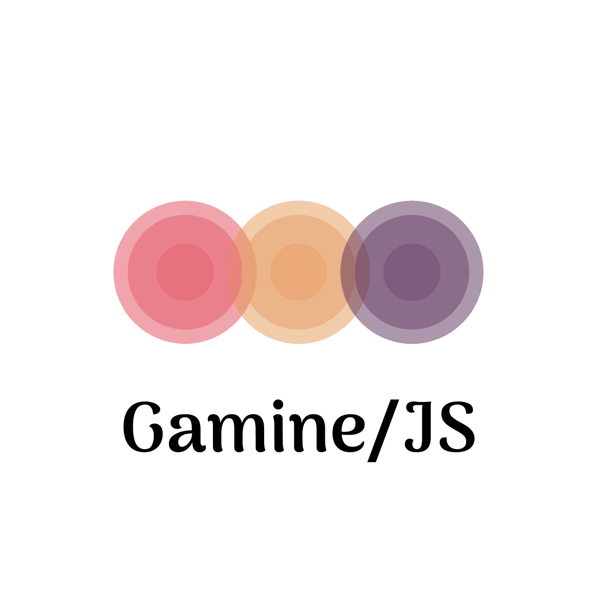

# About
Gamine/JS is a game for the very youngest population, that are just discovering
the computer and how to move the mouse around and hit some keys on the keyboard.

The child uses the mouse to draw coloured dots and lines on the screen.

[<b style="color:red">Play it!</b>](https://vvalchev.github.io/gamine-js/)

# Thanks to
* https://sourceforge.net/projects/gamine-game/ for the original inspiration.
* https://hatchful.shopify.com/ for the beautiful logo.
* https://github.com/NDISCOVER/Arima-Font for the gorgeous font.
* https://calmradio.com/ for the lullaby music.
* https://store.kde.org/content/show.php/Chameleon+Xcursors?content=38459 for the pencil cursor.
